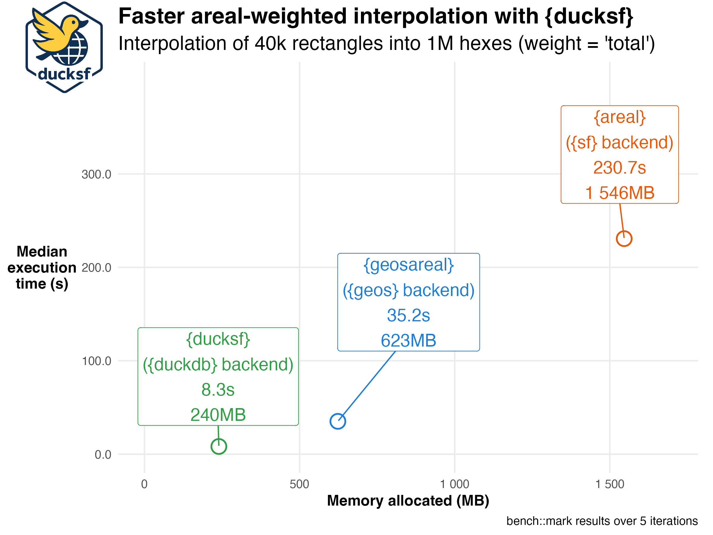
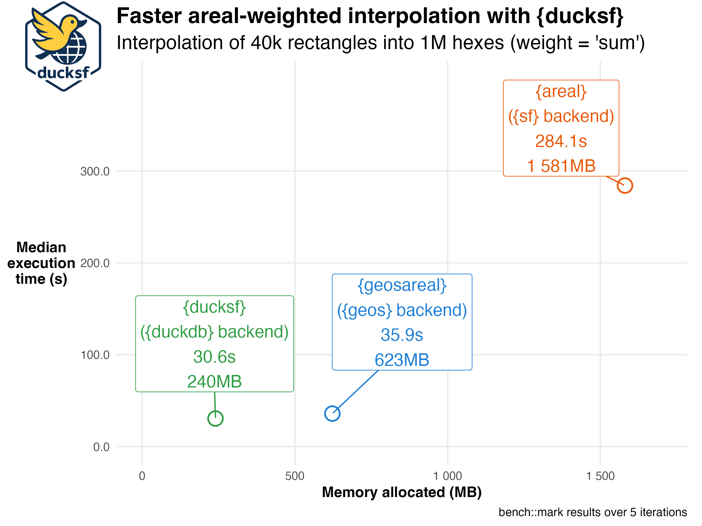
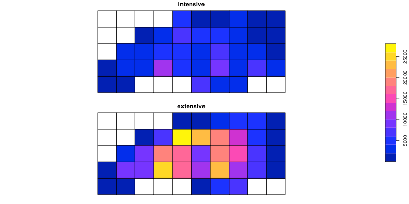

<!-- README.md is generated from README.qmd. Please edit that file -->

# ducksf: Spatial Ops Faster Than sf and geos <a href="https://www.ekotov.pro/ducksf/"></a>

<!-- badges: start -->

[](https://lifecycle.r-lib.org/articles/stages.html#experimental)
[](https://CRAN.R-project.org/package=ducksf)
[](https://github.com/e-kotov/ducksf/actions/workflows/R-CMD-check.yaml)
<!-- [](https://app.codecov.io/gh/e-kotov/ducksf) -->
<!-- badges: end -->

This package provides some alternatives to sf functions, which are
implemented using duckdb and geoarrow. So far the only implemented
function is areal interpolation working similar to the one fiund in
‘areal’ package, but much faster. I have no idea where this project will
go, use at your own risk.

`ducksf` provides **fast, DuckDB Spatial–backed spatial data
operations** for R,  
with a current focus on **areal-weighted interpolation** as a drop-in
alternative to  
`sf::st_interpolate_aw()` and `areal::aw_interpolate()`.

Here’s what you can expect for speed gains and memory savings (measured
on projected planar data):





As you can see from the figures, `ducksf` is much faster than than
`areal::aw_interpolate()` (and `sf::st_interpolate_aw()`, as it works
the same way, but is functionally more limited), especially for large
datasets. It also uses less memory, which is crucial when working with
large spatial datasets. Even though there is a cost of translating `sf`
objects to DuckDB tables and back, the overall performance is
significantly improved.

The misterious `geosareal` package is just a proof-of-concept package
that also implements areal interpolation, but using `geos` instead of
`duckdb`. It is not meant to be used in production and is not
maintained, but the code is available here:
<https://github.com/e-kotov/r-geos-areal-weighted-interpolation-prototype>.

## Installation

You can install the development version of `{ducksf}` from
[GitHub](https://github.com/e-kotov/ducksf) with:

``` r
# install.packages("pak")
pak::pak("e-kotov/ducksf")
```

## Example

This is a basic example which shows you how to solve a common problem
(following the [`sf` package’s
example](https://r-spatial.github.io/sf/reference/interpolate_aw.html) -
our result will be a little different, as we project the data to NAD83 /
Conus Albers (EPSG:5070)):

``` r
## Quick example (using the default `sf` dataset)
library(sf)
library(ducksf)

# data & grid (from sf help)
nc <- st_read(system.file("shape/nc.shp", package = "sf"), quiet = TRUE)
# transform to NAD83 / Conus Albers (EPSG:5070)
nc <- nc |> st_transform(5070)
g <- st_make_grid(nc, n = c(10, 5)) # 'to' can be sfc for sf, but ducksf core needs an sf with an ID

# Prepare IDs for ducksf core
nc$src_id <- seq_len(nrow(nc))
g_sf <- st_as_sf(g)
g_sf$tid <- seq_len(nrow(g_sf))

## 1) ducksf core (dst_interpolate_aw) --------------------------------------

# (a) Treat BIR74 as spatially intensive (not mass-preserving)
a1_core <- dst_interpolate_aw(
  target_sf = g_sf,
  tid = "tid",
  source_sf = nc,
  sid = "src_id",
  weight = "sum", # intensive semantics
  intensive = "BIR74",
  output = "sf"
)
sum(st_drop_geometry(a1_core)$BIR74, na.rm = TRUE) / sum(nc$BIR74, na.rm = TRUE)

# (b) Treat BIR74 as spatially extensive (mass-preserving)
a2_core <- dst_interpolate_aw(
  target_sf = g_sf,
  tid = "tid",
  source_sf = nc,
  sid = "src_id",
  weight = "total", # extensive semantics (pycnophylactic)
  extensive = "BIR74",
  output = "sf"
)
sum(st_drop_geometry(a2_core)$BIR74, na.rm = TRUE) / sum(nc$BIR74, na.rm = TRUE)

# Quick plot (intensive vs extensive)
a_show <- a1_core[, "BIR74"]
names(a_show)[1] <- "intensive"
a_show$extensive <- st_drop_geometry(a2_core)$BIR74
plot(a_show[c("intensive", "extensive")], key.pos = 4)
```



## Mask `{sf}` functions

`{ducksf}` also provides a way to **mask `{sf}` functions** so that they
dispatch to `{ducksf}` instead of `{sf}`. This is useful if you want to
use `{sf}` functions with `{ducksf}` semantics without changing your
code too much. By default it is of course disabled, so you can use
`{sf}` functions as usual even if `{ducksf}` is loaded. The resulting
numbers will be insignificantly different from `{sf}` results due to
rounding errors, but they will be very close.

``` r
## 2) Masked drop-in (sf semantics) -----------------------------------------

# Enable/disable masking so st_interpolate_aw() dispatches to ducksf
sf_use_ducksf(TRUE) # or: sf_use_ducksf(TRUE, allow = "st_interpolate_aw")
sf_use_ducksf(FALSE) # or: sf_use_ducksf(TRUE, allow = "st_interpolate_aw")

a1 <- st_interpolate_aw(nc["BIR74"], g, extensive = FALSE)
sum(a1$BIR74) / sum(nc$BIR74) # not close to 1 (intensive)

a2 <- st_interpolate_aw(nc["BIR74"], g, extensive = TRUE)
sum(a2$BIR74) / sum(nc$BIR74) # ≈ 1 (mass-preserving)

# Compare maps exactly like sf's example
a1$intensive <- a1$BIR74
a1$extensive <- a2$BIR74
plot(a1[c("intensive", "extensive")], key.pos = 4)

# Disable masking when done
sf_use_ducksf(FALSE)
```

## To test speed on relatively large data

*This data and code were used for the tests presented at the top of this
README, but with `bench::mark()` function*

``` r
install.packages(setdiff(
  c(
    "duckdb",
    "sf",
    "areal",
    "geoarrow",
    "terra",
    "geodata",
    "giscoR",
    "tidyverse",
    "tictoc"
  ),
  rownames(installed.packages())
))


library(duckdb)
library(sf)
library(areal)
library(geoarrow)
library(terra)
library(geodata)
library(giscoR)
library(areal)
library(tidyverse)
library(tictoc)
library(ducksf) # remotes::install_github("e-kotov/ducksf")
# also optional if you want to try it yourself, geosareal also does quite well compared to sf-based interpolation
# library(geosareal) # remotes::install_github("e-kotov/r-geos-areal-weighted-interpolation-prototype")

# get data
dir.create("private/data", recursive = TRUE)
pop <- geodata::population(year = 2020, res = 2.5, path = "private/data") # GPWv4 density
nuts2 <- giscoR::gisco_get_nuts(year = "2021", nuts_level = 2, epsg = "4326")
fr2 <- subset(nuts2, CNTR_CODE == "FR")
fr2_mainland <- subset(fr2, !grepl("^FRY|^FRM", NUTS_ID))

# crop pop raster to mainland France
pop_fr <- terra::crop(
  pop,
  st_bbox(fr2_mainland),
  snap = "out"
)
# mask
pop_fr <- terra::mask(pop_fr, fr2_mainland)

# project the raster to EPSG:3035 (ETRS89 / LAEA Europe)
pop_fr <- terra::project(
  pop_fr,
  "EPSG:3035",
  method = "bilinear"
)

# vectorize the raster
# yes, let's imagine there is no terra::extract() or exactextractr::exact_extract()
# and you are bound to the vector world
pop_fr_vec <- as.polygons(pop_fr, aggregate = FALSE) |>
  st_as_sf() |>
  mutate(cell_id = as.character(row_number()))

# generate a hexagonal grid over mainland France
bbox_fr <- st_bbox(st_transform(fr2_mainland, 3035))

cellsize_hex <- 2500 # 2.5 km hexagons
# also try pushing it down to 1km hexes to push the limits of your computer

hex <- st_make_grid(bbox_fr, cellsize = cellsize_hex, square = FALSE) |>
  st_as_sf() |>
  st_set_geometry("geometry") |>
  mutate(hex_id = as.character(row_number()))
nrow(hex) # 171k, would be just over 1 million for 1km hexes
format(object.size(hex), "Mb") # ~200 mb, would be 1,200 mb for 1km hexes


aw_test <- areal::ar_validate(
  source = pop_fr_vec,
  target = hex,
  varList = "population_density",
  method = "aw",
  verbose = TRUE
)
aw_test


Sys.time()
tictoc::tic()
hex_areal <- areal::aw_interpolate(
  .data = hex,
  tid = hex_id,
  source = pop_fr_vec,
  sid = cell_id,
  weight = "total",
  output = "tibble",
  extensive = "population_density"
)
tictoc::toc()
Sys.time()


Sys.time()
tictoc::tic()
hex_ducksf <- ducksf::dst_interpolate_aw(
  target_sf = hex,
  tid = "hex_id",
  source_sf = pop_fr_vec,
  sid = "cell_id",
  weight = "total",
  output = "tibble",
  extensive = "population_density"
)
tictoc::toc()
Sys.time()


Sys.time()
tictoc::tic()
hex_geos <- geosareal::geos_interpolate_aw(
  .data = hex,
  tid = hex_id,
  source = pop_fr_vec,
  sid = cell_id,
  weight = "total",
  output = "tibble",
  extensive = "population_density"
)
tictoc::toc()
Sys.time()
```
